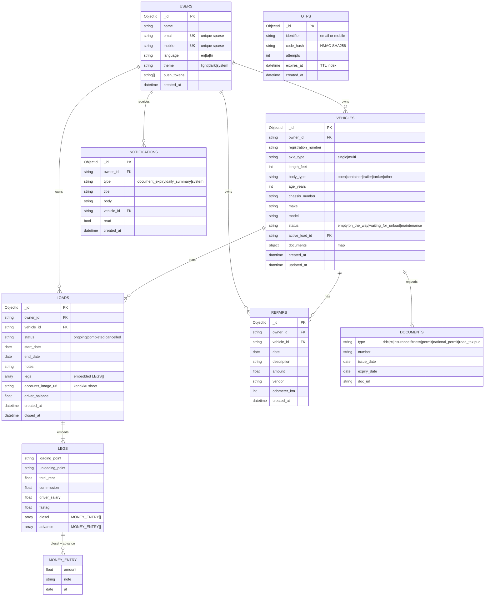

# Data Model (ER Diagram)

MongoDB is document-oriented; this ER diagram shows the logical entities and how they
reference each other. `loads` embed their `legs` (and each leg embeds its repeatable
`diesel` / `advance` money entries) for atomic reads/writes.



## Derived / computed fields (not stored)

- **Document status** (`valid`/`expiring`/`expired`/`unknown`) + `days_to_expiry` + timeline `progress` — computed from `documents[*].expiry_date` vs a 30-day threshold.
- **Load totals** — `spend = diesel + commission + driver_salary + fastag`; `profit = total_rent − spend`; `expected_driver_balance = advance − (diesel + fastag)`.
- **Vehicle** `trips_count` + `total_profit` — aggregated from its completed loads.

## Indexes

| Collection | Index | Purpose |
|------------|-------|---------|
| users | `email` (unique, sparse), `mobile` (unique, sparse) | dual-identifier login |
| otps | `identifier`; `expires_at` (TTL) | lookup + auto-expiry |
| vehicles | `(owner_id, registration_number)`, `(owner_id, status)` | scoping + status filter |
| loads | `(owner_id, vehicle_id, created_at)`, `(owner_id, status)` | per-vehicle history + active loads |
| repairs | `(owner_id, vehicle_id, date)` | per-vehicle log |
| notifications | `(owner_id, created_at)` | feed |
```
